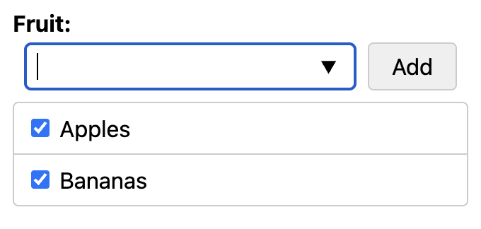

# &lt;multi-options&gt; web component

At its core &lt;multi-options&gt; is a HTML form control helper, designed to wrap around a list of checkboxes and a text field. It then progressively-enhances the contained UI, turning them into a tag-builder, or category-builder field.

See it in action at [ndorfin.github.io/multi-options-webcomponent/](https://ndorfin.github.io/multi-options-webcomponent/)

## Principles

- Support an HTTP form POST/GET in a way a server would expect: One or more `name`/`value` pairs.
- Progressively-enhance
	- a well-described and existing list of chosen pairs (`name`/`value`), [represented as checkboxes]
	- a `datalist` of all known items
	- a text field, which would typically contain any new values not already represented by the checkboxes
- Let the developer decide on:
	- the markup, as long as they use important attributes and good form markup
	- the styling
- Maintain good accessibility

## Limitations

- Since the list of items all use a common `name`, the `value`s for each item can't be sluggified or sanitised.
- Item values can't include commas, or double-quote marks

